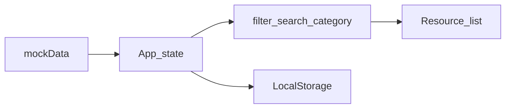

# 工作内容结构（笔试交付）

本文档为 **中文** 的工作计划与过程记录入口；与英文总结 `REFLECTION.md`、工具清单 `docs/TOOL.md`、AI 原文 `docs/AI_LOG.md` 配套使用，满足 `TASK.md` 与 `README.md` 要求。

## 文档关系

| 文档 | 用途 |
|------|------|
| `docs/WORK.md`（本文件） | 验收标准、优先级、现状梳理、问题清单、性能计划、实施日志、回归清单 |
| `REFLECTION.md` | **英文**：Bug 修复说明、性能优化方法与取舍（由本文件「已完成」条目汇总） |
| `docs/TOOL.md` | 工具与依赖清单：每项说明**解决的问题**与**使用场景或关键步骤** |
| `docs/AI_LOG.md` | 与 AI 的完整对话记录（原文，不删改） |

**约束提醒（TASK.md）**：代码注释与对外文档以 **英语** 为准；交付需保证 `npm run dev` 可正常启动。

---

## 1. 背景与目标

- **项目**：Personal Resource Hub（Vue 3 + Vite + TypeScript + Tailwind）。
- **笔试目标**：完成 `README.md` 中的挑战项，并按要求提交代码与文档。
- **交付物自检**：
  - [ ] 代码可运行：`npm install` → `npm run dev`
  - [ ] `REFLECTION.md` 已更新（英文）
  - [ ] `docs/TOOL.md` 已列出所用工具/依赖及用途
  - [ ] `docs/AI_LOG.md` 已保存完整 AI 对话原文
  - [ ] Fork 后仓库可公开访问（按雇主要求打包/提交）

---

## 2. 验收标准（对照 README 五项挑战）

为每项填写：**预期行为**、**验收步骤**、**边界条件**。完成一项即勾选。

### 2.1 缺失 UI 行为（搜索、空状态）

| 项目 | 内容 |
|------|------|
| 预期行为 | |
| 验收步骤 | |
| 边界条件 | |

- [ ] 搜索：输入变化时列表过滤符合预期；清空搜索时恢复。
- [ ] 空状态：无结果 / 无数据时有明确 UI 与可访问提示。

### 2.2 分类筛选 Bug（选中分类未更新列表）

| 项目 | 内容 |
|------|------|
| 预期行为 | 切换分类后列表仅显示该分类（或与产品约定一致）。 |
| 验收步骤 | |
| 边界条件 | 与「全部」、搜索组合时的行为。 |

- [x] 已修复并在此记录根因与修改文件。

### 2.3 LocalStorage 持久化与安全序列化

| 项目 | 内容 |
|------|------|
| 预期行为 | 读写过本地存储时不抛错；异常数据不拖垮页面。 |
| 验收步骤 | 手动损坏/清空 localStorage 后刷新页面。 |
| 边界条件 | 版本迁移、缺字段、非 JSON。 |

- [ ] 已实现安全序列化/解析策略（见实施记录）。

### 2.4 TypeScript 类型与类型安全

| 项目 | 内容 |
|------|------|
| 预期行为 | 关键数据结构与组件 props 有明确类型；减少 `any`。 |
| 验收步骤 | `npm run build` / `npm run lint`（若配置齐全）。 |
| 边界条件 | |

- [x] 已补全类型缺口并记录取舍。
  - 关键点：移除 `src/hooks/useLocalStorage.ts` 中的 `any` 断言，改用类型守卫与安全字段读取；并通过 `npm run build` + `npm run lint` 验证严格模式下无类型错误。

### 2.5 响应式与可访问性（a11y）

| 项目 | 内容 |
|------|------|
| 预期行为 | 常见断点下布局可用；键盘可达、语义合理。 |
| 验收步骤 | 缩放窗口、Tab 聚焦、屏幕阅读器抽样（可选）。 |
| 边界条件 | |

- [ ] 已记录关键 a11y 决策（见实施记录）。

---

## 3. 工作范围与优先级（预修改计划）

| 优先级 | 范围 | 说明 |
|--------|------|------|
| P0 | 分类筛选 Bug、持久化崩溃风险、类型/运行时错误 | 正确性优先 |
| P1 | 搜索与空状态、a11y（键盘/语义/对比度） | 体验与合规 |
| P2 | 性能优化 | 需有复现或指标再动手；说明取舍 |

**本阶段计划摘要**（可写 3～5 条）：

1.
2.
3.

---

## 4. 现状梳理（代码 / 数据流）

### 4.1 关键文件与职责

| 路径 | 职责 |
|------|------|
| `src/App.vue` | 布局与列表/状态组合 |
| `src/components/SearchBar.vue` | 搜索 UI |
| `src/components/Sidebar.vue` | 分类 UI |
| `src/components/ResourceCard.vue` | 单项展示 |
| `src/hooks/useLocalStorage.ts` | 本地持久化 |
| `src/types/resource.ts` | 资源类型 |
| `src/data/mockData.ts` | 模拟数据 |

### 4.2 数据流（简述）

**文字说明**（数据源 → 分类/搜索过滤 → 列表渲染 → 持久化）：

---

## 5. 问题清单与证据

对每条问题使用下表（可复制多份）。

### 问题 P-001

| 字段 | 内容 |
|------|------|
| 类型 | Bug / 体验 / 类型 / a11y / 性能 |
| 现象 | |
| 复现步骤 | 1. … 2. … |
| 影响面 | |
| 初步猜测 | |
| 状态 | 待处理 / 已修复 / 不修复（原因） |

---

## 6. 性能分析计划

### 6.1 方法与工具

- 浏览器：Chrome Performance、Lighthouse（性能/可访问性抽样）
- Vue：Vue DevTools（组件更新、props）（若环境已安装）
- 其他：

### 6.2 关注点与指标

| 关注点 | 如何观察 | 基线 / 优化后（可后填） |
|--------|----------|-------------------------|
| 交互延迟 | Performance 录制 | |
| 重渲染 | DevTools | |
| 主线程占用 | Performance | |

### 6.3 数据量增大时的风险（可选）

若列表变长，是否考虑虚拟列表、memo、拆分计算等——**仅在有证据或明确需求时**写入 `REFLECTION.md` 的 Tradeoffs。

---

## 7. 实施记录（执行日志模板）

每条变更复制一节，便于汇总到英文 `REFLECTION.md`。

### 变更 C-001 — （标题）

| 字段 | 内容 |
|------|------|
| 日期 | |
| 对应挑战 | 2.1 / 2.2 / … |
| 关联问题编号 | P-xxx |
| 复现与基线 | |
| 根因定位 | 文件：`…` 逻辑：… |
| 方案与取舍 | 备选方案：… 未选原因：… |
| 修改文件 | `- file1` `- file2` |
| 自测 / 回归 | 见 §8 勾选 |
| 需更新 TOOL / AI_LOG | [ ] `docs/TOOL.md` [ ] `docs/AI_LOG.md` |

---

## 8. 回归测试清单（Regression checklist）

完成修复后在浏览器中逐项验证并勾选。

- [ ] 首次进入页面，列表与分类与数据一致
- [ ] 切换分类，列表随之更新（**核心**）
- [ ] 搜索：有结果 / 无结果（空状态）
- [ ] 搜索 + 分类组合（若产品需要）
- [ ] 刷新页面：持久化行为符合预期；损坏 localStorage 不白屏
- [ ] Tab 可聚焦主要控件；按钮/链接语义合理
- [ ] 缩小窗口：布局无重叠、可读
- [ ] `npm run dev` 无启动错误

---

## 9. 汇总到 `REFLECTION.md` 的指引（英文）

将本文件中 **状态为「已修复」** 的问题与 **性能相关变更** 提炼为英文，填入 `REFLECTION.md`：

| `WORK.md` 来源 | `REFLECTION.md` 章节 |
|----------------|---------------------|
| §5 问题清单中「已修复」条目 + §7 根因与修改文件 | **Bug Fixes**（具体说明：现象、根因、修复点） |
| §6 性能分析 + §7 中与性能相关的方案 | **Performance Improvements**（方法、指标或前后对比） |
| §7「方案与取舍」 | **Tradeoffs** |

撰写英文时注意：句子完整、可独立阅读；避免只写「fixed bug」而无复现与文件指向。

---

## 10. 提交前自检（TASK.md）

- [ ] 代码注释与对外文档为英语（本 `WORK.md` 可为中文）
- [ ] `REFLECTION.md` 已含 Bug 与性能（及取舍）
- [ ] `docs/TOOL.md` 每项含：解决的问题、场景或步骤
- [ ] `docs/AI_LOG.md` 为完整原文
- [ ] 仓库可访问；Fork 与最终分支符合雇主说明
