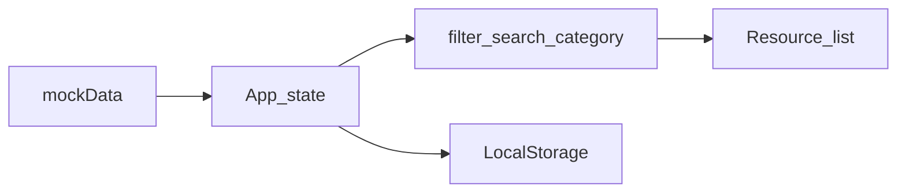

# Work Log Structure (Take-home Submission)

This document is the entry point for the work plan and execution log. It is designed to be used together with the English summary `REFLECTION.md`, the tooling list `docs/TOOL.md`, and the raw AI transcript `docs/AI_LOG.md`, and to satisfy the requirements in `TASK.md` and `README.md`.

## Document Map

| Document | Purpose |
|---|---|
| `docs/WORK.md` (this file) | Acceptance criteria, priorities, current-state notes, issue list, performance plan, implementation log, regression checklist |
| `REFLECTION.md` | **English**: bug-fix explanation, performance improvements, and tradeoffs (summarized from “Done” items in this file) |
| `docs/TOOL.md` | Tools and dependencies: for each item, explain the **problem it solved** and the **scenario / key steps** |
| `docs/AI_LOG.md` | Complete AI conversation log (raw text, do not edit) |

**Constraint reminder (`TASK.md`)**: code comments and external-facing docs should be **in English**; the submission must start correctly with `npm run dev`.

---

## 1. Background & Goals

- **Project**: Personal Resource Hub (Vue 3 + Vite + TypeScript + Tailwind).
- **Take-home goal**: complete the challenge items in `README.md`, and submit code and documents as required.
- **Submission self-check**:
  - [ ] App runs: `npm install` → `npm run dev`
  - [ ] `REFLECTION.md` updated (English)
  - [ ] `docs/TOOL.md` lists tools/dependencies used and their purpose
  - [ ] `docs/AI_LOG.md` contains the full raw AI transcript
  - [ ] Forked repository is publicly accessible (or packaged/submitted per employer instructions)

---

## 2. Acceptance Criteria (Aligned with the 5 README Challenges)

For each item, fill in: **expected behavior**, **verification steps**, and **edge cases**. Check it off once complete.

### 2.1 Missing UI behavior (Search, Empty states)

| Item | Content |
|---|---|
| Expected behavior | |
| Verification steps | |
| Edge cases | |

- [ ] Search: list filtering behaves as expected on input change; clearing the search restores results.
- [ ] Empty state: when there are no results / no data, show clear UI and an accessible hint.

### 2.2 Category filter bug (selected category does not update the list)

| Item | Content |
|---|---|
| Expected behavior | After switching category, the list only shows that category (or matches the product decision). |
| Verification steps | |
| Edge cases | Behavior when combined with “All” and search. |

- [x] Fixed; root cause and changed files recorded here.

### 2.3 LocalStorage persistence & safe serialization

| Item | Content |
|---|---|
| Expected behavior | Reading/writing local storage never crashes; invalid data does not white-screen the app. |
| Verification steps | Manually corrupt/clear localStorage and refresh the page. |
| Edge cases | Version migrations, missing fields, non-JSON values. |

- [ ] Implemented a safe serialize/parse strategy (see implementation log).

### 2.4 TypeScript types & type-safety

| Item | Content |
|---|---|
| Expected behavior | Key data structures and component props are typed; minimize `any`. |
| Verification steps | `npm run build` / `npm run lint` (if configured). |
| Edge cases | |

- [x] Filled type gaps and documented tradeoffs.
  - Key point: removed `any` assertions in `src/hooks/useLocalStorage.ts`, replaced with type guards and safe field reads; validated with `npm run build` + `npm run lint` under strict settings.

### 2.5 Responsiveness & Accessibility (a11y)

| Item | Content |
|---|---|
| Expected behavior | Layout works on common breakpoints; keyboard reachable; semantics are reasonable. |
| Verification steps | Resize the window, tab through controls, sample with a screen reader (optional). |
| Edge cases | |

- [ ] Recorded key a11y decisions (see implementation log).

---

## 3. Scope & Priority (Planned Changes)

| Priority | Scope | Notes |
|---|---|---|
| P0 | Category filter bug, persistence crash risks, type/runtime errors | Correctness first |
| P1 | Search + empty states, a11y (keyboard/semantics/contrast) | UX and compliance |
| P2 | Performance optimization | Only do with evidence/metrics; document tradeoffs |

**Plan summary for this phase** (3–5 bullets):

1.
2.
3.

---

## 4. Current State (Code / Data Flow)

### 4.1 Key files and responsibilities

| Path | Responsibility |
|---|---|
| `src/App.vue` | Layout and composition of list/state |
| `src/components/SearchBar.vue` | Search UI |
| `src/components/Sidebar.vue` | Category UI |
| `src/components/ResourceCard.vue` | Item rendering |
| `src/hooks/useLocalStorage.ts` | Local persistence |
| `src/types/resource.ts` | Resource types |
| `src/data/mockData.ts` | Mock data |

### 4.2 Data flow (brief)

**Narrative** (data source → category/search filtering → list rendering → persistence):

---

## 5. Issue List & Evidence

Use the template below for each issue (copy as needed).

### Issue P-001

| Field | Content |
|---|---|
| Type | Bug / UX / Type / a11y / Performance |
| Symptom | |
| Steps to reproduce | 1. … 2. … |
| Impact | |
| Initial hypothesis | |
| Status | Todo / Done / Won’t fix (reason) |

---

## 6. Performance Analysis Plan

### 6.1 Methods and tools

- Browser: Chrome Performance, Lighthouse (sampling performance/a11y)
- Vue: Vue DevTools (component updates, props) (if installed)
- Other:

### 6.2 Focus areas and metrics

| Focus | How to observe | Baseline / After (fill later) |
|---|---|---|
| Interaction latency | Performance recording | |
| Re-renders | DevTools | |
| Main-thread time | Performance | |

### 6.3 Risks as data grows (optional)

If the list becomes large, consider virtualization, memoization, splitting computations, etc. — only write into `REFLECTION.md` tradeoffs **when there is evidence or a clear requirement**.

---

## 7. Implementation Log (Change Template)

Copy one section per change to make it easy to summarize in the English `REFLECTION.md`.

### Change C-001 — (Title)

| Field | Content |
|---|---|
| Date | |
| Challenge mapping | 2.1 / 2.2 / … |
| Related issue IDs | P-xxx |
| Repro & baseline | |
| Root cause | File: `…` Logic: … |
| Solution & tradeoffs | Alternatives: … Why not chosen: … |
| Files changed | `- file1` `- file2` |
| Self-test / regression | See §8 checklist |
| Needs TOOL / AI_LOG update | [ ] `docs/TOOL.md` [ ] `docs/AI_LOG.md` |

---

## 8. Regression Checklist

After each fix, verify each item in the browser and check it off.

- [ ] First load: list, categories, and data are consistent
- [ ] Switch categories: the list updates accordingly (**core**) 
- [ ] Search: has results / no results (empty state)
- [ ] Search + category combo (if required by product)
- [ ] Refresh: persistence behaves as expected; corrupted localStorage does not white-screen
- [ ] Tab can focus primary controls; button/link semantics are reasonable
- [ ] Narrow viewport: no overlap; readable layout
- [ ] `npm run dev` starts without errors

---

## 9. Guide for Summarizing into `REFLECTION.md` (English)

Extract items marked **Done** (especially bug fixes and performance-related changes) and write them in English in `REFLECTION.md`:

| Source in `WORK.md` | Section in `REFLECTION.md` |
|---|---|
| “Done” items in §5 + root cause/files in §7 | **Bug Fixes** (symptom, root cause, fix, and where) |
| §6 performance analysis + performance-related solutions in §7 | **Performance Improvements** (method, metrics, before/after if available) |
| “Solution & tradeoffs” in §7 | **Tradeoffs** |

When writing in English: make sentences self-contained and readable. Avoid vague statements like “fixed bug” without reproduction context or file pointers.

---

## 10. Pre-submission Checklist (`TASK.md`)

- [ ] Code comments and external-facing docs are in English
- [ ] `REFLECTION.md` includes bugs + performance (and tradeoffs)
- [ ] `docs/TOOL.md` entries include: problem solved + scenario/steps
- [ ] `docs/AI_LOG.md` is complete raw text
- [ ] Repo is accessible; fork/branch matches employer instructions
